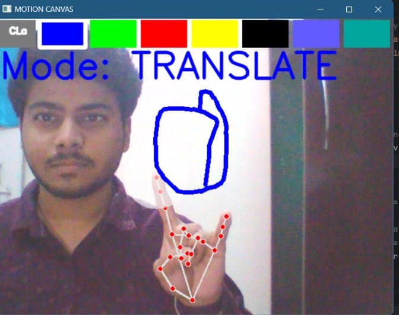

# Motion Canvas

Motion Canvas is an interactive drawing application that allows you to draw and erase on a canvas using hand gestures. It utilizes computer vision techniques to detect hand movements and translate them into drawing actions on the canvas.


## Authors

- [@Subhang](https://www.github.com/hacnay)


## Features
* Draw on the canvas: Use your index finger to draw lines on the canvas.
* Erase mode: Activate erase mode by making a specific hand gesture, allowing you to erase parts of the drawing.
* Translate mode: Activate translate mode by making another hand gesture, allowing you to move the drawing on the canvas.
* Real-time feedback: The application provides real-time feedback by displaying the detected hand gestures and drawing actions on the screen.


## Badges

[](https://choosealicense.com/licenses/mit/)


## Requirements
* Python 3.x
* OpenCV
* NumPy
* Mediapipe


## Installation

1 - Clone the repository:
[CLONE ME](https://github.com/hacnay/Motion_Canvas)

2 - Change the directory to the project folder:
``` 
  
  cd motion-canvas
```

3 - Install the required dependencies:    
``` 
  
  pip install -r requirements.txt

```


## Usage
* Run the motioncanvas.py script:

``` 
  
python main.py


```

* The webcam will be activated, and the application will start capturing video frames.

* Use your hand gestures to interact with the canvas:

  * Extend your index finger to draw lines on the canvas.
  * Make a specific gesture to activate erase mode and erase parts of the drawing.
  * Make another gesture to activate translate mode and move the drawing on the canvas.
* Press 'q' or 'esc' to quit the application.


## Screenshots



